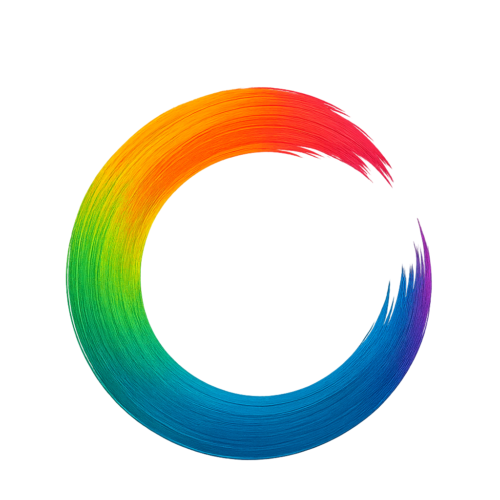
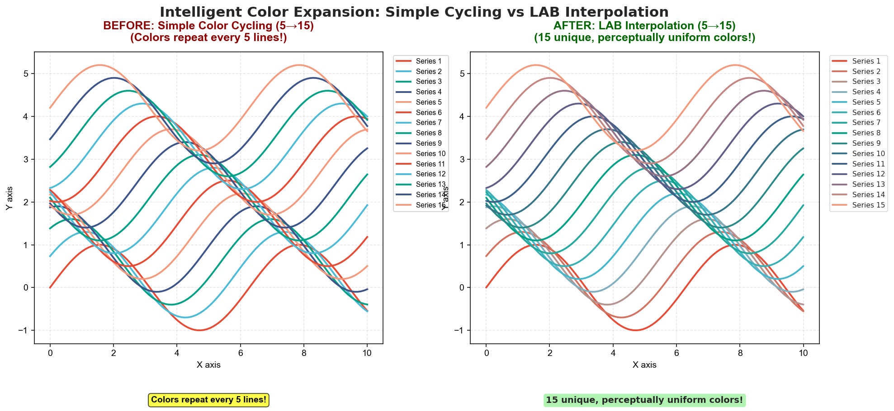
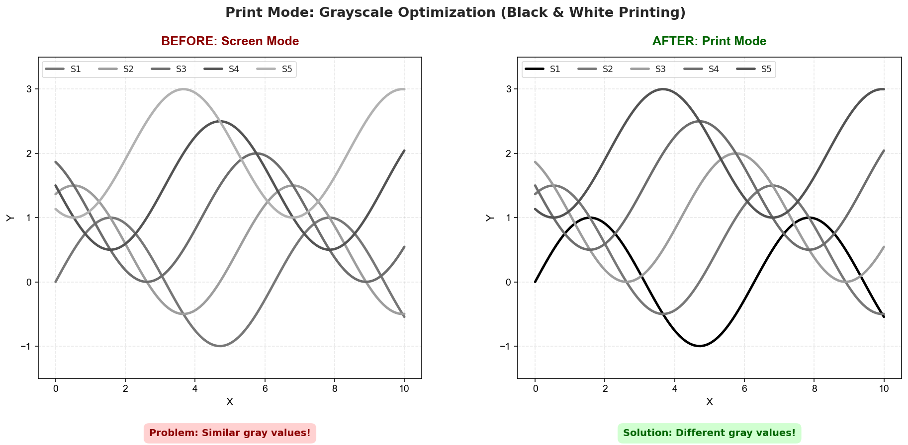

<p align="center">
  
</p>

<h1 align="center">Huez</h1>

<p align="center">
  <em>The First Intelligent Color Management System for Python Visualization</em>
  <br />
  <strong>Automatic • Consistent • Accessible • Smart</strong>
</p>

<!-- Key Metric: Downloads -->

<p align="center">
  <a href="https://pepy.tech/project/huez">
    
  </a>
</p>

<!-- Static Project Info -->

<p align="center">
  
  
  
  
</p>

---

## 💡 The Problem

**Good science shouldn't be ruined by bad colors.**

Yet creating publication-quality visualizations in Python is still tedious:

- ❌ **Inconsistent colors** across matplotlib, seaborn, plotly...
- ❌ **Manual tweaking** for every single plot
- ❌ **No intelligent tools** - colormaps, accessibility checks all manual
- ❌ **8% of readers** (colorblind) may misinterpret your results

## ✨ The Solution

```bash
pip install huez
```

```python
import huez as hz

# 🎨 One line for screen, print, and presentation
hz.use("scheme-1")  # Optimized colors for screen
hz.use("scheme-1", mode="print")  # Grayscale-friendly for printing
hz.use("scheme-1", mode="presentation")  # High contrast for projectors

# ✨ Huez automatically handles:
#   • Intelligent color expansion (LAB interpolation)
#   • Smart colormap detection (sequential/diverging)
#   • Cross-library consistency (matplotlib, seaborn, plotly, altair, plotnine)
```

## ✨ What Makes Huez Different?

**Huez is the only tool that combines:**

- 🧠 **Intelligence** - Smart colormap detection, LAB color interpolation, colorblind safety
- 🚀 **Automation** - One-line setup, automatic heatmap colormap injection
- 🎯 **Unification** - 5 libraries (matplotlib, seaborn, plotly, altair, plotnine) consistent
- 🖨️ **Multi-Mode** - Screen, print (grayscale-friendly), and presentation (high-contrast)
- ♿ **Accessibility** - Built-in colorblind simulation for 8% of population
- 🎨 **Professional** - Academic journal styles (Nature, Lancet, Science, JAMA, etc.)

---

## 🎨 Visual Demonstrations

### 1️⃣ Intelligent Color Expansion (5 → 15 colors)

<p align="center">
  
</p>

**Problem**: Default palettes have 5-10 colors → colors repeat when plotting 15+ categories
**Solution**: Huez uses LAB space interpolation → generates 15 unique, perceptually distinct colors

*Smooth color gradation with maximum distinguishability.*

---

### 2️⃣ Smart Colormap Detection (Correlation Heatmap)

<p align="center">
  
</p>

**Problem (Left)**: Sequential colormap (viridis) on diverging data → center value (0) not highlighted  
**Solution (Right)**: Auto-detected diverging colormap (coolwarm) → center at 0, symmetric red-blue colors

*Critical for correlation matrices, gene expression, and any data centered at zero.*

---

### 3️⃣ Colorblind Accessibility (8% of Population)

<p align="center">
  
</p>

**Simulated in Deuteranopia (red-green colorblindness):**

- **Before (Left)**: Default colors → red/green bars become indistinguishable 
- **After (Right)**: Huez colorblind-safe palette → all 8 cell types remain distinct

*8% of males have red-green colorblindness. Huez ensures your research is accessible to all.*

---

### 4️⃣ Print Mode: Grayscale Optimization

<p align="center">
  
</p>

**When printed in black & white:**

- **Before (Left)**: Screen colors → similar gray values (0.33-0.70) → lines merge together
- **After (Right)**: `mode="print"` → optimized gray values (0.00-0.62) → clear separation

*Perfect for journal submissions and B&W printing. Starting with pure black (0.00) ensures maximum contrast.*

---

## 🔧 Usage Guide

### ✅ Correct Usage (Fully Automatic)

```python
import huez as hz
import matplotlib.pyplot as plt
import seaborn as sns

hz.use("scheme-1")  # One line setup

# ✅ Line plots - automatic colors
plt.plot(x, y1, label='Series 1')  
plt.plot(x, y2, label='Series 2')

# ✅ Heatmaps - automatic colormap detection
sns.heatmap(correlation_data)  # Diverging colormap (has negatives)
sns.heatmap(temperature_data)  # Sequential colormap (all positive)
```

### ❌ Incorrect Usage (Manual Override)

```python
# ❌ WRONG: Explicit parameters override Huez
plt.plot(x, y1, color='red')       # Bypasses Huez
sns.heatmap(data, cmap='viridis')  # Bypasses auto-detection
```

**Key Principle**: Let Huez handle colors automatically for optimal results.

**Why this works**: Huez intelligently adapts to your data—detecting data types, expanding colors when needed, and ensuring accessibility—all without any manual intervention.

---

## 🔍 Preview & Quality Checks

```python
# Preview any scheme before using
hz.preview("scheme-1")  # Interactive color preview
hz.preview("scheme-1", mode="print")  # Preview in print mode

# List all available schemes
schemes = hz.list_schemes()
print(schemes)  # ['scheme-1', 'scheme-2', 'scheme-3', 'lancet', 'nejm', ...]

# Optional: Ensure colorblind accessibility
hz.use("scheme-1", ensure_accessible=True)
```

---

<details>
<summary>📚 <b>Supported Libraries (Click to expand)</b></summary>

### Matplotlib

```python
import matplotlib.pyplot as plt
plt.plot(x, y1, label='Data 1')  # Auto-colored
plt.plot(x, y2, label='Data 2')  # Auto-colored
```

### Seaborn

```python
import seaborn as sns
sns.scatterplot(data=df, x='x', y='y', hue='category')  # Auto-colored
```

### plotnine (ggplot2 for Python)

```python
from plotnine import *
(ggplot(df, aes('x', 'y', color='category')) + geom_point())  # Auto-colored
```

### Altair

```python
import altair as alt
alt.Chart(df).mark_circle().encode(
    x='x:Q', y='y:Q', color='category:N'  # Auto-colored
)
```

### Plotly

```python
import plotly.graph_objects as go
fig = go.Figure()
fig.add_trace(go.Scatter(x=x, y=y, name='Data'))  # Auto-colored
```

</details>

<details>
<summary>🎨 <b>Custom Schemes (Click to expand)</b></summary>

### Switch Between Built-in Schemes

```python
hz.use("lancet")     # Lancet journal style
hz.use("scheme-1")   # Default scheme 1
hz.use("scheme-2")   # Default scheme 2
```

### Create Custom Configuration

**Create `my_config.yaml`:**

```yaml
version: 1
default_scheme: my_custom_scheme
schemes:
  my_custom_scheme:
    title: "My Custom Style"
    fonts: { family: "DejaVu Sans", size: 10 }
    palettes:
      discrete: "npg"
      sequential: "viridis"
      diverging: "coolwarm"
      cyclic: "twilight"
    figure: { dpi: 300 }
    style: { grid: "y", legend_loc: "best", spine_top_right_off: true }
```

**Load and use:**

```python
hz.load_config("my_config.yaml")
hz.use("my_custom_scheme")
```

### Available Built-in Palettes

- **Journals**: `npg`, `aaas`, `nejm`, `lancet`, `jama`, `bmj`
- **Colorblind-safe**: `okabe-ito`, `paul-tol-bright`, `paul-tol-vibrant`
- **Scientific**: `viridis`, `plasma`, `inferno`, `cividis`

</details>

<details>
<summary>📖 <b>Complete Examples (Click to expand)</b></summary>

### Example 1: Basic Multi-Library Workflow

```python
import matplotlib.pyplot as plt
import seaborn as sns
import huez as hz

# One line setup
hz.use("lancet")

# All libraries automatically use consistent colors
fig, axes = plt.subplots(1, 2, figsize=(12, 5))

# Matplotlib
axes[0].plot(x, y1, label='Series 1')
axes[0].plot(x, y2, label='Series 2')
axes[0].legend()

# Seaborn
sns.scatterplot(data=df, x='x', y='y', hue='category', ax=axes[1])

plt.show()
```

### Example 2: Intelligent Features

```python
import numpy as np
import seaborn as sns
import huez as hz

# Enable intelligent coloring with accessibility check
hz.use("scheme-1", ensure_accessible=True)

# Auto-expand colors for many categories
x = np.linspace(0, 10, 100)
colors = hz.expand_colors(hz.colors()[:5], 12)

# Smart colormap for heatmap
correlation_data = np.random.randn(10, 10)
sns.heatmap(correlation_data, cmap=hz.smart_cmap(correlation_data))

plt.show()
```

### Example 3: Context Manager

```python
import huez as hz

# Temporarily use a different scheme
with hz.using("lancet"):
    plt.plot(x, y1)  # Uses lancet colors
    plt.show()

# Back to previous scheme automatically
```

</details>

---

<details>
<summary>🆚 <b>Comparison with Other Tools (Click to expand)</b></summary>

| Feature                               | Huez            | palettable  | seaborn         | plotly          | colorcet    |
| ------------------------------------- | --------------- | ----------- | --------------- | --------------- | ----------- |
| **Cross-library unification**   | ✅ 5 libraries  | ❌ None     | ❌ None         | ❌ None         | ❌ None     |
| **Intelligent color expansion** | ✅ LAB space    | ❌ None     | ❌ Simple cycle | ❌ Simple cycle | ❌ None     |
| **Smart colormap detection**    | ✅ Auto-detect  | ❌ Manual   | ❌ Manual       | ❌ Manual       | ❌ Manual   |
| **Colorblind safety check**     | ✅ 3 CVD types  | ❌ None     | ❌ None         | ❌ None         | ❌ None     |
| **Chart complexity adaptation** | ✅ Auto-suggest | ❌ None     | ❌ None         | ❌ None         | ❌ None     |
| **One-line setup**              | ✅`hz.use()`  | ❌ Per-plot | 🟡 Partial      | 🟡 Partial      | ❌ Per-plot |
| **Academic journal styles**     | ✅ 6+ journals  | 🟡 Some     | ❌ None         | ❌ None         | ❌ None     |

**Huez is the only tool with built-in intelligence for automatic adaptation.**

</details>

---

## 🤝 Contributing

Contributions are welcome! Please feel free to submit a Pull Request.

## 📄 License

This project is licensed under the MIT License - see the [LICENSE](LICENSE) file for details.

<div align="center">

---

### 🎯 Scientific Visualization Made Better

**⭐ Star us on GitHub if Huez saves your time!**

</div>
