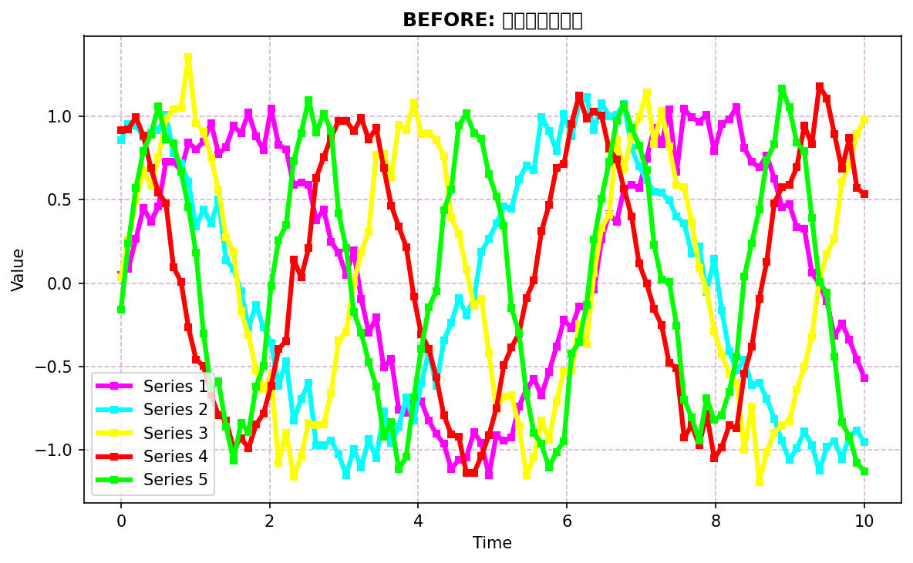

<p align="center">
  
</p>

<h1 align="center">Huez</h1>

<p align="center">
  <em>A Unified Color Scheme Solution for Python Visualization</em>
  <br />
  <a href="#features">✨ Features</a> •
  <a href="#installation">🚀 Quick Start</a> •
  <a href="#usage">📚 Libraries</a> •
  <a href="#schemes">🎨 Schemes</a>
</p>

<!-- Key Metric: Downloads (This is the new section) -->
<p align="center">
  <a href="https://pepy.tech/project/huez"> <!-- Ensure 'huez' is the correct package name on PyPI -->
    
  </a>
</p>

<!-- Static Project Info -->
<p align="center">
  
  
  
  
</p>

<p align="center">
  <em>"Good visualizations should not be ruined by bad color schemes."</em>
</p>

**Huez** is a unified Python visualization color scheme solution that instantly upgrades your charts from amateur to professional publication-quality.

## ✨ Features

- 🚀 **True Automatic Coloring**: All major libraries support native syntax automatic coloring, no manual color specification needed
- 🎯 **Perfect Cross-Library Consistency**: Matplotlib, Seaborn, plotnine, Altair, Plotly completely unified color experience
- 🎨 **Rich Built-in & Custom Schemes**: Professional academic palettes plus easy custom scheme creation and loading
- ⚡ **Zero Learning Cost**: Use native syntax of each library, no need to learn additional APIs
- 🔧 **One Line Does It All**: Just `hz.use("scheme-1")` to enable automatic coloring for all libraries

## 🎨 Before & After Visual Comparisons

See the dramatic difference Huez makes to your visualizations! Each section shows the same data plotted with default library colors (left) vs. professional Huez color schemes (right).

### 📊 Multi-Series Line Plots

**Matplotlib - Default vs Huez Enhanced**

| Default Colors | Huez "Nature Journal Style" (scheme-1) |
|---|---|
|  |  |

**Seaborn - Default vs Huez Enhanced**

| Default Colors | Huez "Science Journal Style" (scheme-2) |
|---|---|
|  |  |

### 📈 Scatter Plots with Categories

**Plotly - Default vs Huez Enhanced**

| Default Colors | Huez "NEJM Style" (scheme-3) |
|---|---|
|  |  |

### 📊 Bar Charts

**Altair - Default vs Huez Enhanced**

| Default Colors | Huez "Lancet Style" (scheme-4) |
|---|---|
|  |  |

**plotnine - Default vs Huez Enhanced**

| Default Colors | Huez "JAMA Style" (scheme-5) |
|---|---|
|  |  |

### 🌈 Sequential & Diverging Color Schemes

**Heatmaps with Sequential Scales**

| Default | Huez Viridis | Huez Plasma | Huez Cividis |
|---|---|---|---|
|  |  |  |  |

**Diverging Heatmaps**

| Default RdBu | Huez Vik | Huez Roma | Huez Coolwarm |
|---|---|---|---|
|  |  |  |  |

### 🎨 Journal-Style Color Palettes

**Nature Publishing Group (NPG)** - Perfect for scientific publications


**American Association for the Advancement of Science (AAAS/Science)**


**New England Journal of Medicine (NEJM)**


**The Lancet**


**Journal of the American Medical Association (JAMA)**


**British Medical Journal (BMJ)**


### 🎯 Colorblind-Friendly Options

**Okabe-Ito Colors** - Optimized for colorblind accessibility


**Paul Tol Bright** - High contrast, colorblind-friendly


**Paul Tol Vibrant** - Maximum accessibility


## 🖼️ Generate Your Own Comparisons

Want to see the difference Huez makes with your own data? Use our demo scripts!

### Quick Demo Script

Run this simple script to instantly see before/after comparisons:

```bash
python demo_comparison.py
```

This creates three comparison images:
- `before_huez_demo.png` - Default library colors
- `after_huez_demo.png` - Huez-enhanced colors
- `huez_schemes_comparison.png` - All 5 built-in schemes side-by-side

### Advanced Comparison Generator

For comprehensive visual comparisons across all libraries and schemes:

```bash
python generate_comparison_images.py
```

This generates all the comparison images shown above in the `./assets/` directory.

### Manual Color Comparison

Can't run the scripts? Here's a quick manual comparison:

```python
import matplotlib.pyplot as plt
import numpy as np

# Sample data
x = np.linspace(0, 10, 100)
y1 = np.sin(x)
y2 = np.cos(x)
y3 = np.sin(x*2)

# BEFORE: Default colors
plt.figure(figsize=(10, 4))

plt.subplot(1, 2, 1)
plt.plot(x, y1, label='Series 1')
plt.plot(x, y2, label='Series 2')
plt.plot(x, y3, label='Series 3')
plt.title('BEFORE: Default Colors')
plt.legend()

# AFTER: Huez enhanced
import huez as hz
hz.use("scheme-1")  # Nature Journal Style

plt.subplot(1, 2, 2)
plt.plot(x, y1, label='Series 1')
plt.plot(x, y2, label='Series 2')
plt.plot(x, y3, label='Series 3')
plt.title('AFTER: Huez Enhanced')
plt.legend()

plt.tight_layout()
plt.show()
```

## 🚀 Quick Start

### Installation

```bash
pip install huez
```

### Basic Usage

```python
import huez as hz

# 🎨 One line of code, global coloring
hz.use("scheme-1")

# ✨ Now all libraries automatically color using native syntax!
```

## 📚 Supported Visualization Libraries

**Matplotlib**

```python
import matplotlib.pyplot as plt
plt.plot(x, y1, label='Data 1')  # Pure native syntax - colors auto-applied!
plt.plot(x, y2, label='Data 2')  # Pure native syntax - colors auto-applied!
plt.legend()
```

**Seaborn**

```python
import seaborn as sns
sns.scatterplot(data=df, x='x', y='y', hue='category')  # Pure native syntax - colors auto-applied!
```

**plotnine**

```python
from plotnine import *
(ggplot(df, aes('x', 'y', color='category')) + 
 geom_point())  # Pure native syntax - colors auto-applied!
```

**Altair**

```python
import altair as alt
alt.Chart(df).mark_circle().encode(
    x='x:Q', y='y:Q', color='category:N'  # Pure native syntax - colors auto-applied!
)
```

**Plotly**

```python
import plotly.graph_objects as go
fig = go.Figure()
fig.add_trace(go.Scatter(x=x, y=y, name='Data'))  # Pure native syntax - colors auto-applied!
```

## 🎨 Rich Built-in & Custom Schemes

Huez comes with a rich collection of **professional color schemes** and supports **easy customization**:

### ✨ Custom Schemes

```python
# Switch between built-in schemes
hz.use("lancet")  # Academic journal style
hz.use("scheme-2")  # Alternative color palette

# Load custom configuration file
hz.load_config("my_custom_config.yaml")
hz.use("my_custom_scheme")
```

**Create custom config file (my_custom_config.yaml):**

```yaml
version: 1
default_scheme: my_custom_scheme
schemes:
  my_custom_scheme:
    title: "My Custom Style"
    fonts: { family: "DejaVu Sans", size: 10 }
    palettes:
      discrete: "npg"
      sequential: "viridis"
      diverging: "coolwarm"
      cyclic: "twilight"
    figure: { dpi: 300 } # Set project-wide DPI, size is controlled in code
    style: { grid: "y", legend_loc: "best", spine_top_right_off: true }
```

## 🔧 How Huez Works

**Huez takes over color management for your visualizations.** To use Huez effectively:

- **Remove explicit color parameters** from your plotting code (e.g., `color='red'`, `palette=['blue', 'green']`)
- **Let Huez handle colors automatically** through its unified schemes
- **Switch between different journal styles** without changing your code logic
- **Huez only affects global defaults** - it doesn't interfere with explicit local color settings when you need them

## 📄 License

This project is licensed under the MIT License - see the [LICENSE](LICENSE) file for details.

<div align="center">

---

⭐ **If this project helps you, please give us a star!** ⭐

</div>
