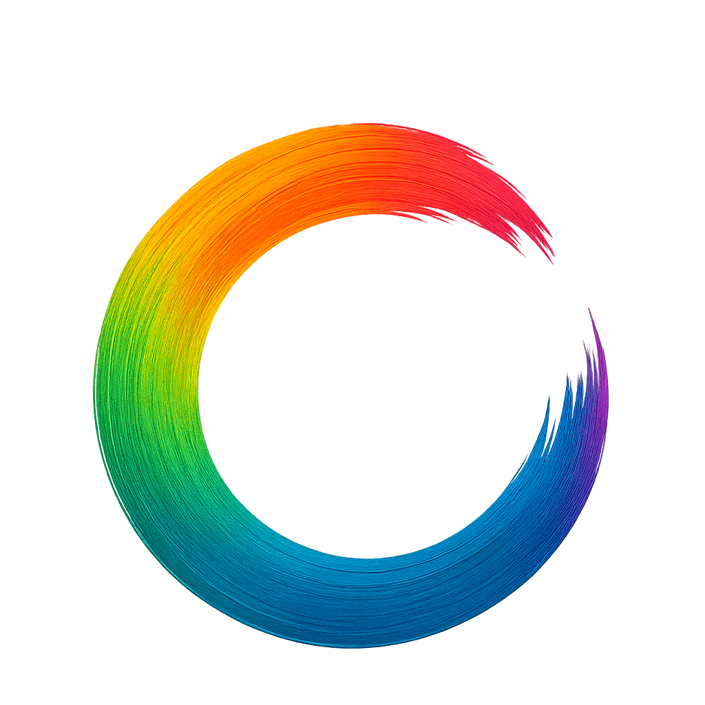

Huez Documentation
==================

|

**The First Intelligent Color Management System for Python Visualization**

*Automatic • Consistent • Accessible • Smart*

.. raw:: html

   

   <strong>One line for screen, print, and presentation</strong>
   

.. code-block:: python

   import huez as hz
   
   hz.use("scheme-1")  # One line for all libraries
   
   # Works automatically with:
   # matplotlib, seaborn, plotly, altair, plotnine

What Makes Huez Different?
---------------------------

Huez addresses three critical challenges in scientific visualization:

1. 🎨 **Fragmentation** - Seamless integration across 5 major Python visualization libraries
2. 🧠 **Intelligence** - Automatic color adaptation based on data distribution and chart type  
3. ♿ **Accessibility** - Built-in colorblind safety verification for 8% of the population

Key Features
------------

.. grid:: 2
   :gutter: 3

   .. grid-item-card:: 🚀 Cross-Library Unification
      :link: user_guide/basic_usage
      :link-type: doc
      
      One line setup works consistently across matplotlib, seaborn, plotly, altair, and plotnine.

   .. grid-item-card:: 🧠 Intelligent Color Expansion
      :link: intelligence/color_expansion
      :link-type: doc
      
      LAB space interpolation generates unlimited perceptually distinct colors.

   .. grid-item-card:: 🎯 Smart Colormap Detection
      :link: intelligence/colormap_detection
      :link-type: doc
      
      Automatically detects sequential vs. diverging data for optimal colormap selection.

   .. grid-item-card:: ♿ Colorblind Safety
      :link: intelligence/accessibility
      :link-type: doc
      
      Real-time simulation of 3 types of color vision deficiency with WCAG compliance.

   .. grid-item-card:: 🖨️ Multi-Mode Support
      :link: user_guide/color_modes
      :link-type: doc
      
      Screen, print (grayscale-friendly), and presentation (high-contrast) modes.

   .. grid-item-card:: 🎨 Professional Palettes
      :link: gallery/palettes
      :link-type: doc
      
      Academic journal styles (Nature, Lancet, JAMA) and colorblind-safe palettes.

Quick Example
-------------

.. code-block:: python

   import matplotlib.pyplot as plt
   import seaborn as sns
   import huez as hz

   # One line setup
   hz.use("scheme-1")

   # All libraries automatically use consistent colors
   fig, axes = plt.subplots(1, 2, figsize=(12, 5))

   # Matplotlib
   axes[0].plot(x, y1, label='Series 1')
   axes[0].plot(x, y2, label='Series 2')
   axes[0].legend()

   # Seaborn
   sns.scatterplot(data=df, x='x', y='y', hue='category', ax=axes[1])

   plt.show()

.. note::

   **Key Principle**: Let Huez handle colors automatically for optimal results.
   Avoid explicit color parameters (``color='red'``, ``cmap='viridis'``) to enable
   intelligent adaptation.

Quick Links
-----------

.. grid:: 2
   :gutter: 2

   .. grid-item-card:: 📦 Installation
      :link: installation
      :link-type: doc
      
      Get started with pip install huez

   .. grid-item-card:: ⚡ Quick Start
      :link: quickstart
      :link-type: doc
      
      5-minute tutorial

   .. grid-item-card:: 📚 User Guide
      :link: user_guide/index
      :link-type: doc
      
      Comprehensive tutorials

   .. grid-item-card:: 🎨 Gallery
      :link: gallery/index
      :link-type: doc
      
      Visual examples

   .. grid-item-card:: 🔧 API Reference
      :link: api/index
      :link-type: doc
      
      Complete API documentation

   .. grid-item-card:: 🚀 Advanced Topics
      :link: advanced/index
      :link-type: doc
      
      Architecture and customization

Comparison with Other Tools
----------------------------

.. list-table::
   :header-rows: 1
   :widths: 30 14 14 14 14 14

   * - Feature
     - Huez
     - palettable
     - seaborn
     - plotly
     - colorcet
   * - Cross-library unification
     - ✅ 5 libs
     - ❌
     - ❌
     - ❌
     - ❌
   * - Intelligent color expansion
     - ✅ LAB
     - ❌
     - ❌
     - ❌
     - ❌
   * - Smart colormap detection
     - ✅ Auto
     - ❌
     - ❌
     - ❌
     - ❌
   * - Colorblind safety check
     - ✅ 3 types
     - ❌
     - ❌
     - ❌
     - ❌
   * - One-line setup
     - ✅
     - ❌
     - 🟡
     - 🟡
     - ❌
   * - Academic journal styles
     - ✅ 6+
     - 🟡
     - ❌
     - ❌
     - ❌

**Huez is the only tool with built-in intelligence for automatic adaptation.**

Citation
--------

If you use Huez in your research, please cite:

.. code-block:: bibtex

   @software{huez2025,
     author = {Zhiang He},
     title = {Huez: An Intelligent Color Management System for Python Visualization},
     year = {2025},
     url = {https://github.com/hzacode/huez},
     version = {0.0.5}
   }

Contents
--------

.. toctree::
   :maxdepth: 2
   :caption: Getting Started
   
   why_huez
   installation
   quickstart

.. toctree::
   :maxdepth: 2
   :caption: User Guide
   
   user_guide/index

.. toctree::
   :maxdepth: 2
   :caption: Intelligence Features
   
   intelligence/index

.. toctree::
   :maxdepth: 2
   :caption: Library Support
   
   library_support/index

.. toctree::
   :maxdepth: 2
   :caption: Gallery
   
   gallery/index

.. toctree::
   :maxdepth: 2
   :caption: Community
   
   comparison
   faq

.. toctree::
   :maxdepth: 2
   :caption: API Reference
   
   api/index

.. toctree::
   :maxdepth: 2
   :caption: Advanced Topics
   
   advanced/index

.. toctree::
   :maxdepth: 1
   :caption: Development
   
   contributing
   changelog

Indices and tables
==================

* :ref:`genindex`
* :ref:`modindex`
* :ref:`search`

